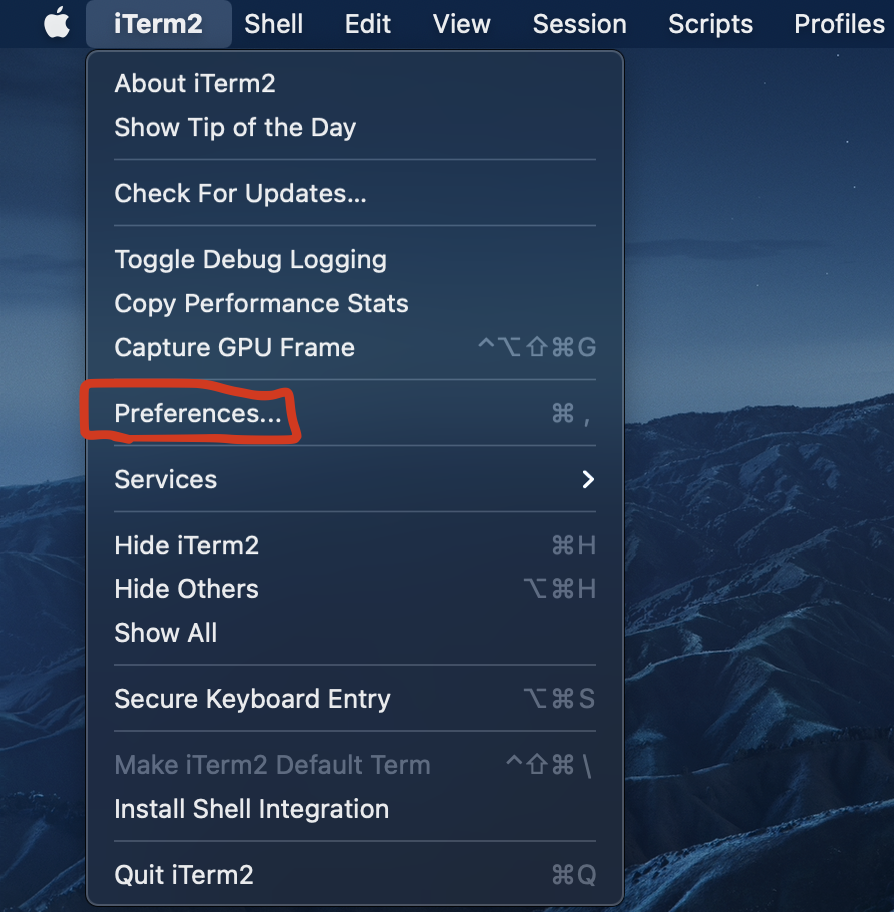
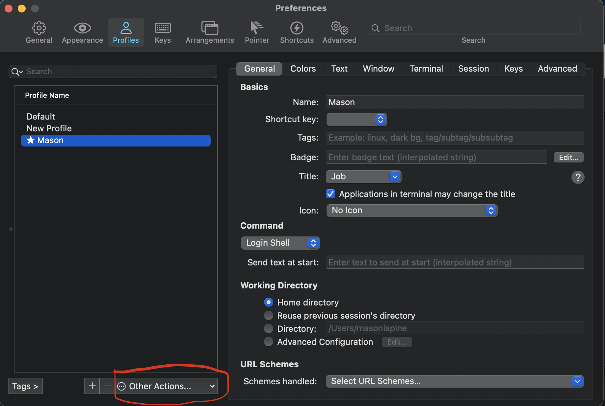
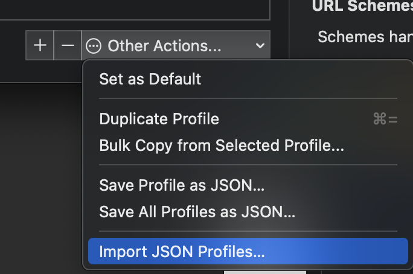
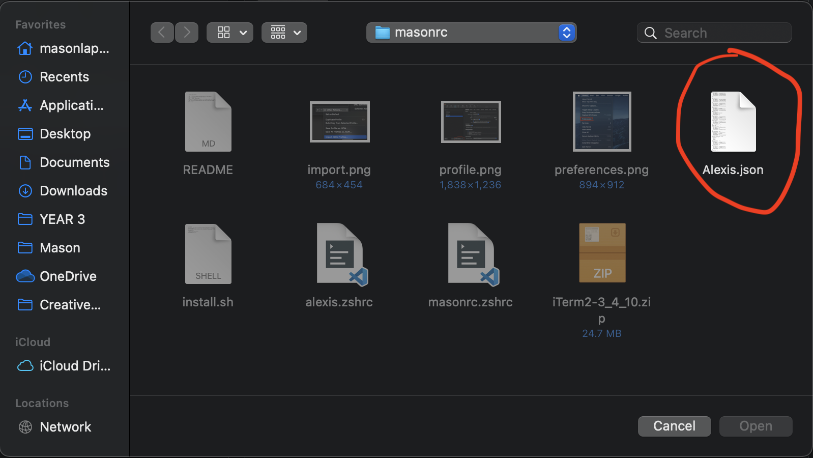
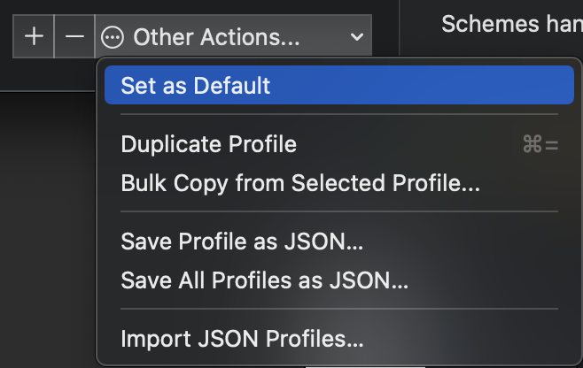

# Terminal Helper Install

1. Open a terminal.
2. Run: ```git clone git@github.com:mwl4263/masonrc.git && cd masonrc```
3. Run ```./install.zsh```
4. Hit the Command and Space button at the same time.
5. Type ```iTerm2``` and hit Enter
6. You should be greeted with a terminal.  Go to the menu bar and select Preferences as shown below.

7. Then select Profiles and add the Alexis.json profile in the masonrc folder that you downloaded via git clone and make it the default profile.




8. Close out and restart iTerm
9. Your new profile should be loaded.